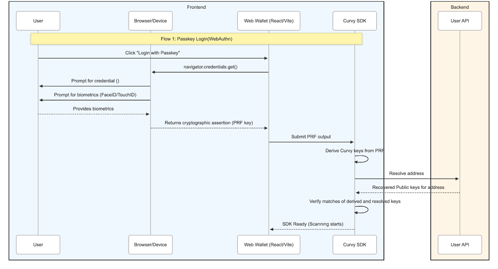
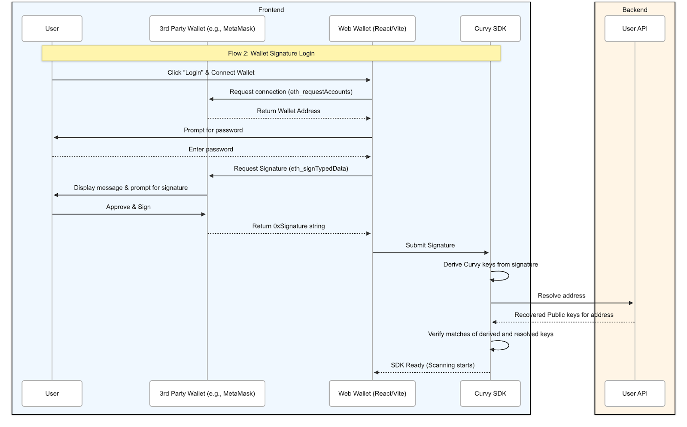

# Curvy ID

> [!TIP]
> To get a mathematical understanding of how stealth addresses are derived in the Curvy protocol using viewing and spending keys, take a look at our previous research:
>
> - ["Elliptic Curve Pairing Stealth Address Protocols"](https://arxiv.org/abs/2312.12131)
> - ["Post-Quantum Secure Stealth Address Protocols"](https://eprint.iacr.org/2025/112.pdf)

## What makes a Curvy user?

A Curvy user is identified by the following tuple:

- Curvy ID (e.g. `travica.curvy.name`)
- [Viewing public key](#viewing-public-key)
- [Spending public key](#spending-public-key)
- [BabyJubJub public key](#babyjubjub-public-key)

All of this information is completely public and is used when:

- using the SDK to send funds to a Curvy user
- opening the public page (<https://travica.curvy.name>) to get new receiving addresses
- resolving the receiving address using ENS (e.g. `travica.curvy.name`)

### BabyJubJub public key

[BabyJubJub](https://docs.iden3.io/publications/pdfs/Baby-Jubjub.pdf) is an elliptic curve primarily used for its usefulness in zk-SNARK proofs.

The cryptography behind how BJJ keys are used to derive and encrypt Notes in the Privacy Aggregator is explained in more detail on the [Privacy aggregator](./privacy-aggregator.md) page.

User's BJJ public key is used to address a new Note during aggregation in the Privacy Aggregator.

### Viewing public key

The viewing public key is necessary to construct proper stealth addresses and notes for the user.

The corresponding viewing private key can be shared by the user with a third party to gain access to their private transaction history that would otherwise be completely hidden.
The private key is envisioned to be shared when the user wants to prove their transactional activity but does not want to give control over their funds.

### Spending public key

This public key is necessary to construct proper stealth addresses and Portal recovery addresses for the user.

Explained in more detail in the [Compliance](/for-the-curious/compliance-model) section, the spending public key is used to recover funds not deemed compliant by Curvy, and whose entry was blocked from the Privacy Aggregator.

The recovery of Portal funds is a completely transparent on-chain action; in addition to returning non-compliant funds, it is also used when an unsupported token is sent to a Portal address.  

## How are Curvy user's private keys generated?

Curvy users' private keys are generated by deriving them from a deterministic source.

Depending on the login/sign-up method, these deterministic sources can be either [FIDO2 Passkeys with PRF extensions](https://bitwarden.com/blog/prf-webauthn-and-its-role-in-passkeys/)
or signature points of a message hashed with a well-known salt and a user-supplied password produced by signing with a third-party crypto wallet.

## Passkey authentication

## 3rd party wallet (signature) authentication

