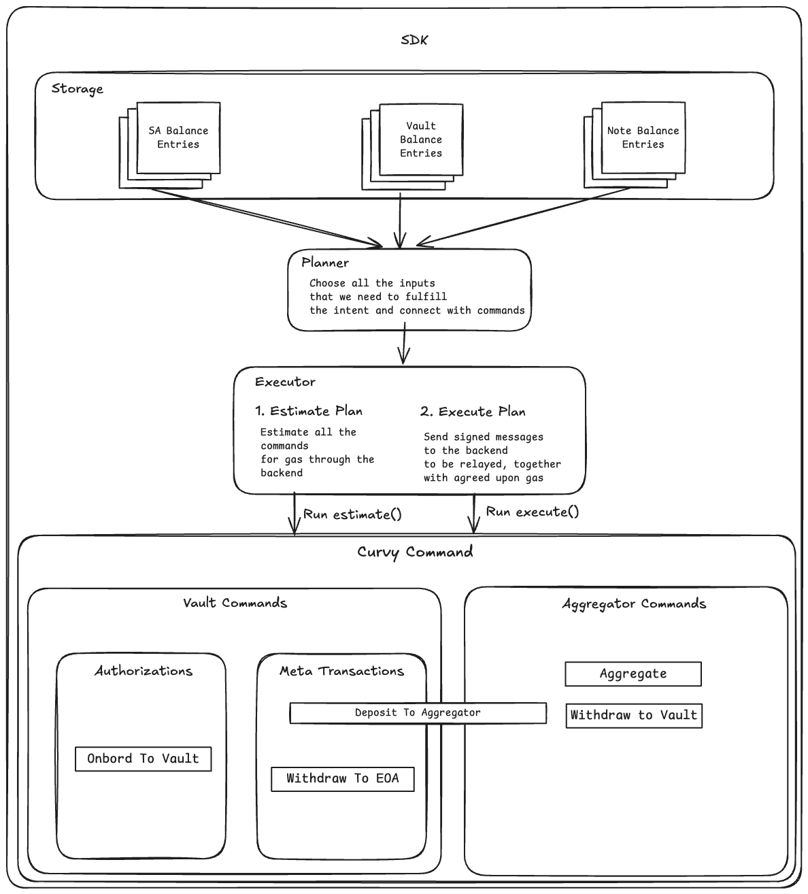

# Curvy SDK

> [!TIP]
> This page aims to explain the core concepts behind Curvy SDK. 
> If you're looking to build with Curvy SDK, visit the [Curvy for programmers](/for-programmers/index.md) section.

Curvy SDK facilitates:
- Logging into Curvy
- Key derivation
- Announcement scanning
- Note scanning
- Signing notes
- Generating ZK proofs
- Planning intent execution
- Executing intents
- Retrying failed attempts
- Resolving Curvy IDs
- EIP-7702 and Meta-transaction-based gas sponsorships

and all through a simple API that lets the user specify the **intent**, and not an explicit of actions.


To accomplish this, SDK has background processes that syncs and scans Notes, Portals and other potential sources of users balances to build a coherent picture
of the users private portfolio.

This is what we refer to **Balance Storage**.

The brains of the SDK is what we call the **Planner**.

Planner is able to execute simple intents such as:

```typescript
const plan = sdk.generatePlan({
  recipient: "0xd8dA6BF26964aF9D7eEd9e03E53415D37aA96045",
  amount: parseEther("1"),
  currency: "ETH",
  network: "Polygon"
})

await sdk.executePlan(plan);

const newBalances = await sdk.refreshBalances();
console.dir(newBalances)
```

The above code snippet will generate a plan for transferring 1 ETH to on address on Polygon.
Because user's balance could have been fragmented across different contracts, stealth addresses and notes, it is the task of the **Planner** to create an execution plan that 
will pool the funds together **without sacrificing privacy**.

The smallest unit of execution inside the SDK's Planner and Executor is called a **Command**.

We are currently working on examples of 3rd party Commands you can add to Curvy SDK to allow for custom dApp and DeFi interactions.



> [!NOTE]
> Curvy SDK is 100% open-source and is used exactly as is in the [Curvy App](https://app.curvy.box) (we ❤️ dogfooding).
> <br>
> We invite you to take a look at the [0xCurvy/sdk](https://github.com/0xCurvy/sdk/) GitHub repository and open issues for any improvements or bugs you can think of.
