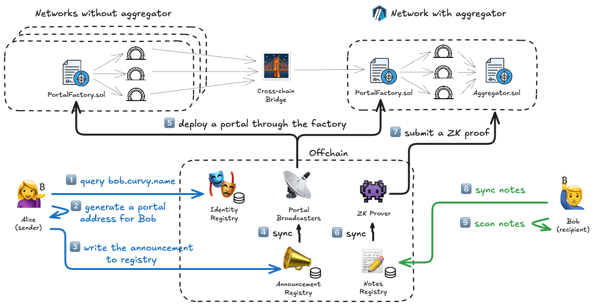

# Receiving funds privately

**Alice the client**, wants to send a salary to her **consultant Bob**.

Alice is using Metamask with Ledger to manage her company's treasury, while Bob, a privacy-savvy crypto professional
uses Curvy so that his clients don't get unnecessary insight into his earnings and spendings.

Bob has provided Alice with instructions to complete the payment to his ENS: bob.curvy.name, or to simply
open https://bob.curvy.name and continue with payment there.

Bob made it clear that **he only accepts payment in USDC, but hasn't made it clear which network to use**.

Without asking, Alice send the funds to Bob's private address on Ethereum, but was reassured by Bob that *the system
he's using should pick up the
transfers on Polygon, BSC, Arbitrum, Optimism, Linea, Base or Gnosis.*

**Bob is using Curvy, but Alice the sender can keep using Ledger + Metamask without knowing what Curvy is.**

## Steps explained in detail

### 🔵 Alice

1. Alice enters `bob.curvy.name` into her wallet of choice. In the background an **ENS resolver** powered by **Curvy SDK**
   fetches Bob's public keys from the **Identity Registry**.
2. Using the **Curvy SDK**, a random nonce, and Bob's public keys a new **Portal** address is generated that
   bob can receive funds to - no contract is deployed on that address yet.
3. This tuple of information that was generated in step two, is what's called an announcement, and is stored in a public
   **Announcement Registry**.

### ⚫ Curvy

4. **Curvy Portal Broadcaster** is continuously syncing announcements from the publicly available API.
5. After observing a Portal address that has received any of the supported funds, it has the needed incentive to
   initiate the deployment of the **Portal** contract through the **Portal Factory**. During the deployment, because the
   address of the portal is deterministically calculated with the anonymous **Announcement** as input, funds are
   automatically bridged if needed and shielded inside the Privacy Aggregator, funds are automatically bridged if needed
   and shielded inside the **Privacy Aggregator**.
6. **Curvy ZK Prover** is continuously keeping in sync with the Notes emitted by the **Aggregator.sol**, indexed in the
   public **Notes Registry**.
7. After a deposit event is observed on the **Aggregator.sol**, the **ZK Prover** will start constructing the proof for
   the deposit of the new note. After a successful proof verification on the chain, the new note is emitted and a new
   version of the resulting notes tree is verified using on-chain ZK verifiers which are a part of the **Aggregator.sol**.

### 🟢 Bob

8. Some unknown time later, Bob logs into his **Curvy App**. In the background, immediately upon starting, Curvy App
   using the open-source **Curvy SDK** starts syncing the notes from the public **Notes Registry**, serving as a fast index of on-chain events emitted by **Aggregator.sol**.
9. In Bob's browser, the **Curvy SDK** simultaneously starts scanning the notes it has sycned with his private keys to
   detect which of the notes are secretly in his ownership, and to decrypt their balances.

> [!IMPORTANT]
> From the perspective of an on-chain observer, Alice has sent funds to a regular EOA address to which later a smart contract (Portal) was deployed by the Portal Broadcaster. This deployment moved the funds to the Curvy Privacy Protocol (Aggregator.sol) **and most importantly the new owner of these funds (Bob) is completely hidden**.
