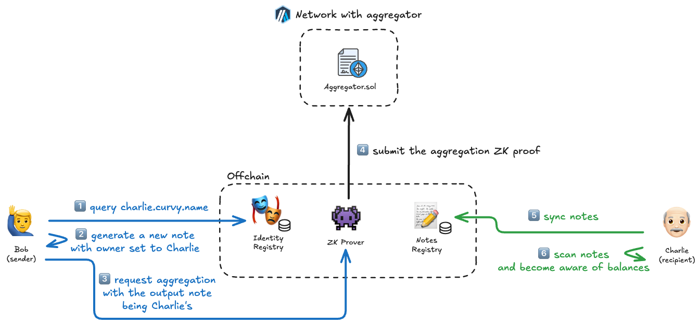

# Sending funds privately

Bob needs to pay his subcontractor, Charlie, who also uses Curvy for the services he provided. 

Charlie has a registered Curvy ID: `charlie.curvy.name`

## Steps explained in detail

### 🔵 Bob

1. Bob queries charlie.curvy.name in the identity registry, fetching Charlie's public keys
2. Using the **Curvy SDK**, a new note is created for which Charlie is the owner. This information is hidden from everyone except Bob and Charlie.
3. Aggregation is requested so that Bob's notes are spent, and a new output note owned by Charlie is created, essentially using the aggregation process for transferring funds.

### ⚫ Curvy

4. Using the supplied notes and ownership proofs, the **ZK Prover** generates a new aggregation proof and submits it on-chain.

### 🟢 Charlie

5. Some time later, after logging into the Curvy App, new notes are synced
6. Simultaneously, notes are scanned for ownership by Charlie, and a new balance is detected.

> [!IMPORTANT]
> Although this is the simplest process in Curvy, it is also the most private, as the exact:
> **amount, currency, sender and recipient are completely hidden from the public eye.**
