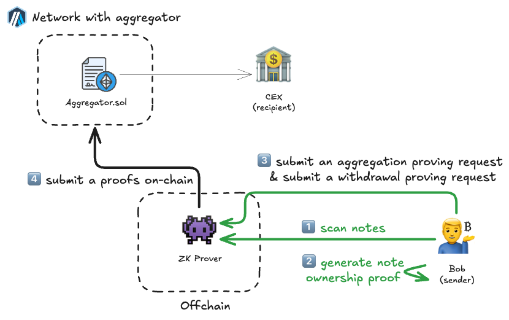

# Unshielding funds privately

After some time and many privately and securely received payments from his clients, Bob is ready to sell a portion of his crypto on a centralized exchange (CEX) to buy a house.

In the previous scenario, we covered the first of the three actions of **Aggregator.sol**: shielding.

Now we will need to use the other two: aggregation and unshielding.

## Steps explained in detail

### 🟢 Bob

1. Bob syncs and scans notes from the public **Notes Registry**.
2. After matching notes for ownership during scanning, the **Curvy SDK** generates local ownership proofs used to decrypt the note balances and the exact token.

### ⚫ Curvy
3. The **Curvy SDK** on Bob's side then submits aggregation requests that merge multiple notes, followed by a subsequent unshielding request.
4. After generating the proofs, the **ZK Prover** submits them on-chain to **Aggregator.sol**. **Aggregator.sol**, after verifying the withdrawal proof, automatically initiates the unshielding process from itself to the Centralized Exchange's address.

> [!IMPORTANT]
> From the perspective of an on-chain observer, funds have simply moved from **Aggregator.sol** to the CEX's address. The information about the previous owner of the funds, and the notes themselves that were aggregated into a single note for unshielding, is completely hidden.
