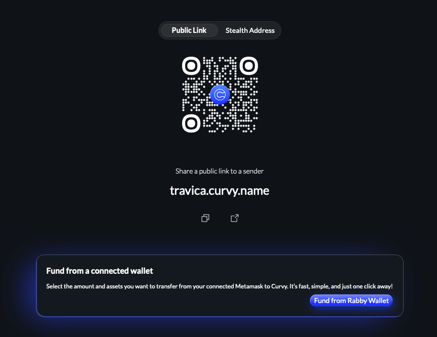

# Make Your Existing Assets Private

To be able to use Curvy to pay privately, you first need to get some assets in your Curvy app.

This process is commonly referred to as "shielding", as Curvy shields your funds from prying eyes.

## From the Curvy app

The easiest way to shield funds is to connect your existing wallet by clicking on the *Fund from a connected wallet*
in the bottom right corner in the right sidebar in the Curvy app.



## From an ENS compatible wallet

If you are using a wallet that supports Ethereum Name Service, such as Metamask or Rabby,
you can just enter your Curvy ID as the recipient for a new transaction:


## Receiving from other wallets

To receive funds from other wallets, you can simply instruct the sender to open up the following URL:

```
https://your-curvy-id.curvy.name
```

This will create a one time private receiving address they can send the funds to.

An example with [https://travica.curvy.name](https://travica.curvy.name):


