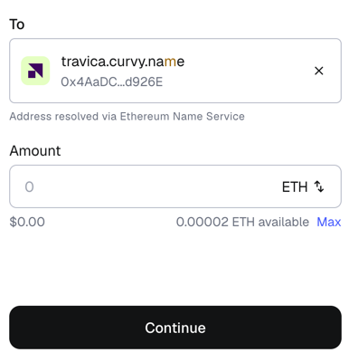
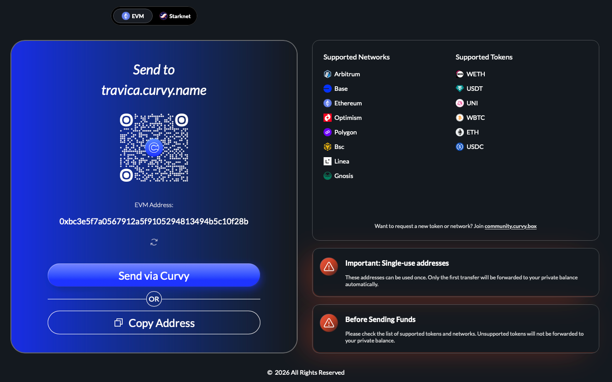

# Receive assets privately

One of the most unique things about Curvy is how easy it is to share payment instructions with senders.

People sending you assets never need to know what Curvy is, how it works, or to open the Curvy App.
They just need to copy and paste your public URL or ENS address (which is also ideally very easy to remember).

> [!TIP]
> You can receive assets on any network listed in the [supported networks](../introduction). Curvy will automatically bridge your funds using LiFi and shield them on Arbitrum.

Below are three ways you can share payment instructions with senders so that you can receive assets automatically shielded in Curvy.

## By sharing your ENS

The easiest way for someone to send you assets is by using your Curvy ID in an ENS-compatible wallet such as Rabby or MetaMask.

The sender can simply enter your Curvy ID as the recipient for a new transaction:



## By sharing your public URL

If the sender's wallet doesn't support ENS, they can always open your public URL

```
https://your-curvy-id.curvy.name
```

and copy the generated address to the wallet of their choice.

An example with [https://travica.curvy.name](https://travica.curvy.name):



## By generating a private address

If you are, for example, withdrawing funds from an exchange, you will not be able to enter the ENS as the withdrawal address or send a URL through a message, as it's an automated process.

In this case, you'd simply follow the steps explained above in ["By sharing your public URL"](#by-sharing-your-public-url)
and copy the newly generated private address to the withdrawal form.
