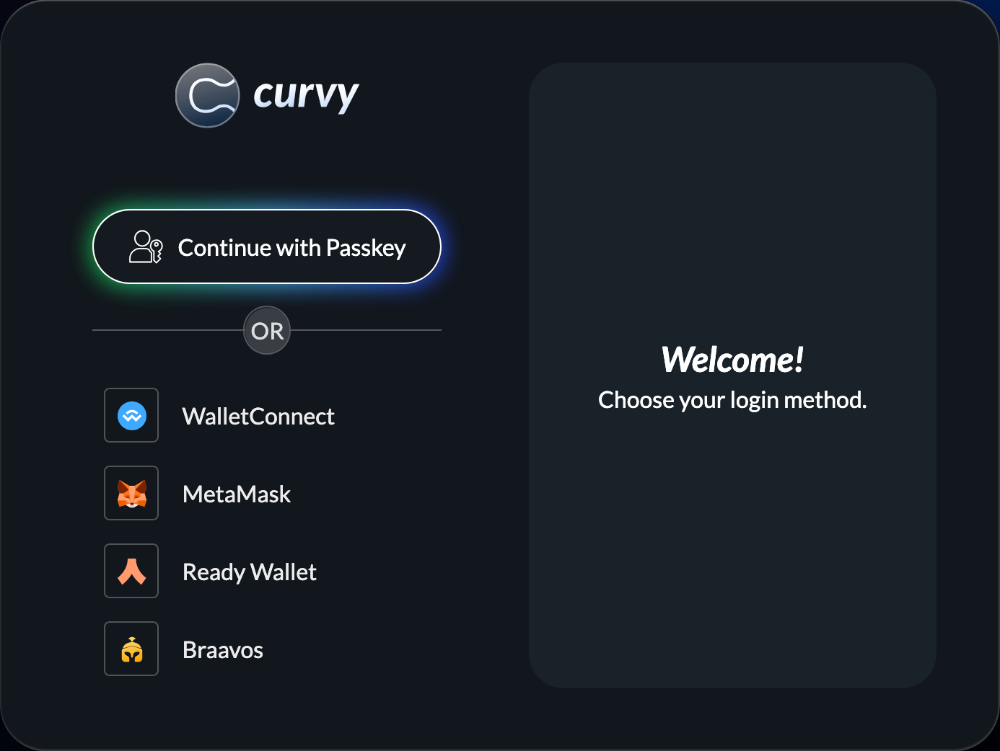

# Register Your Curvy ID

To set up your Curvy Wallet, the first step is to register your Curvy ID.

A Curvy ID is like a personal email address or an internet domain that other people can use to privately send funds to you.

::: warning

Curvy App is a self-custody wallet. That means you control your account. If you lose access, nobody, not even Curvy, can recover it.
So please read the following steps carefully and follow them to stay safe.

Curvy never stores your password or private keys.

:::

## Step 1: Choose your Curvy ID

Upon opening [app.curvy.dev](https://app.curvy.dev) and clicking on **Create New Account**,
you will be prompted to choose the desired Curvy ID.

A good way to choose a Curvy ID is to make sure it is:

- Easy to pronounce and spell
- Unambiguous
- Your alias

You are free to even set your full name as the Curvy ID, as it will only be used when
addressing payments to you. The underlying privacy protocol ensures that only the sender knows to whom the funds are addressed.

After choosing your Curvy ID, you can either use a Passkey ([more on passkeys](https://www.eff.org/deeplinks/2023/10/what-passkey))
or to sign up using a Web3 wallet.

## Step 2a: Register using a Passkey

Make sure your passkey storage is Google, Apple, or 1Password, and that you are accessing through supported browsers:

- Google Chrome
- Apple Safari
- Samsung Internet

If you have backed up your Passkey to Google's or Apple's cloud storage, you will also be able to log in on desktops using your mobile device.

> [!TIP]
> Passkeys are a good and secure way to access the Curvy App on both desktop and mobile devices without needing a cryptocurrency wallet.

## Step 2b: Register using an existing wallet

> [!NOTE]
>
> - If you are on **desktop**, ensure you have a compatible wallet browser extension or a WalletConnect supported wallet.
> - If you are on **mobile**, ensure you are opening Curvy through a wallet browser, or using a WalletConnect supported wallet.

To get started:

- Tap `Connect Wallet` on the Curvy web app.

- Select the wallet you’d like to use to create your Curvy account (e.g. Argent, MetaMask, Braavos).
  The wallet you connect becomes the key to your Curvy account. Combined with the password you'll set up in the next steps, it provides the most secure way to access and manage your Curvy web app.

- Next, you'll need a password to protect your wallet. Curvy combines your original wallet signature with the password you create to generate your private keys, ensuring your account is secure and fully self-custodial.

> [!TIP]
> Ensure you keep your password safe and back up your Curvy keys right after creating your account. If you lose access to your wallet or forget your password, your backup keys will be the only way to recover your funds.

- Curvy will next ask you to sign a message. This isn't a blockchain transaction; it's a local action that enables your wallet to generate the keys needed to manage your Curvy account and funds. This happens entirely in your browser. Your private keys remain on your device and are never uploaded, shared, or stored anywhere else.

> [!NOTE]
> To learn more about how the authentication process in Curvy works, you can refer to the section [For the Curious](../for-the-curious/authentication.md)

