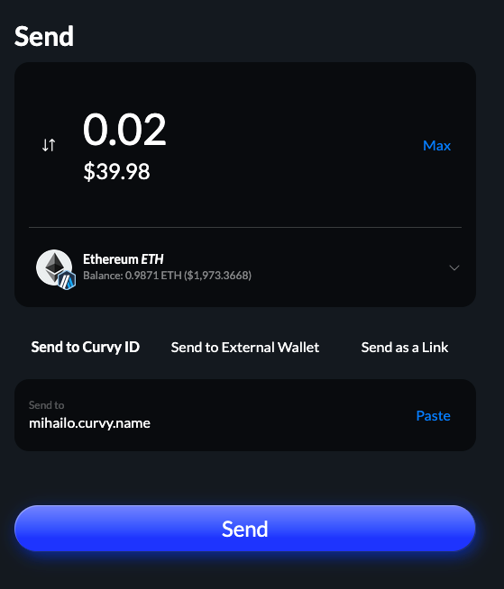
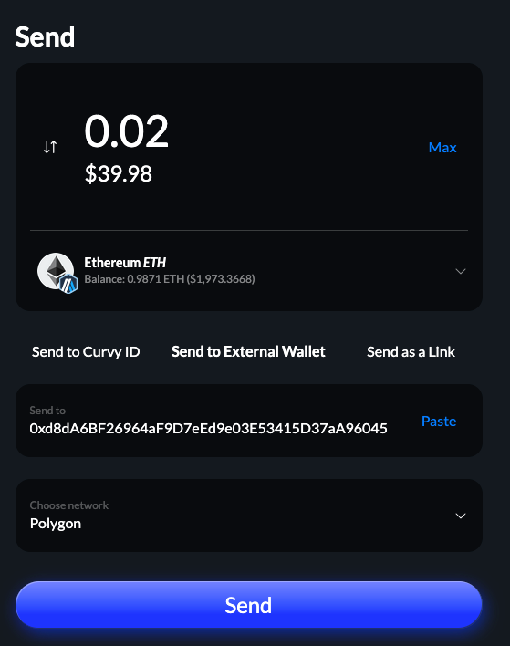
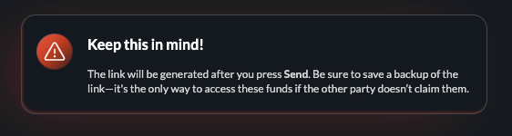
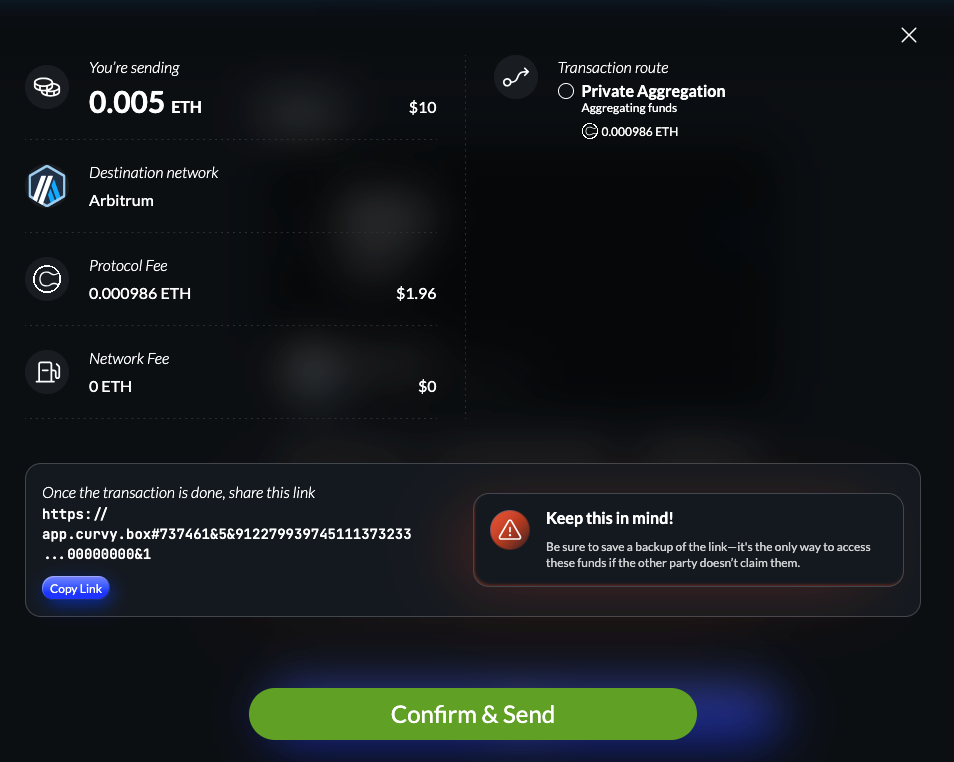

# Send assets privately

There are three ways to send assets from your Curvy web app, depending on whether the recipient:

- already has a registered Curvy ID: [Send to Curvy ID](#send-to-curvy-id)
- wants to receive funds to a regular Ethereum account (EOA address): [Send to external wallet](#send-to-external-wallet)
- doesn't have a crypto wallet or address but wants to onboard to Curvy: [Send as a link](#send-as-a-link)

## Send to Curvy ID

When the recipient already has a registered Curvy ID, you can select the *Send to Curvy ID* option.

In the screenshot below, you can see an example of sending to *mihailo.curvy.name*:



## Send to external wallet

When the recipient only has a blockchain address they can share with you, you'll need to select
both the network where they will receive the funds and the exact address.

In the example below, we are sending the funds to `0xd8d...` on the Polygon network.



## Send as a link

The third option in the send dialog, **Send as a link**, allows you to generate a single-use link that
anyone can use to register or log in to a Curvy account and claim the funds you've sent them.

This is useful in situations where:

- You have a secure messaging channel with the recipient but don't know their address or Curvy name
- The user doesn't have Curvy or any other crypto wallet
- You want to give someone a crypto "giftcard"

> [!WARNING]
> A couple of important things about **Send as a link** feature:
> <br>
>
> 1. Curvy links don't expire! The only way for you to get back the funds that were unclaimed is to claim the funds using the link yourself.
> <br>
> 2. Make sure that you always back up the link before sending!
> <br>
> 3. Keep the links safe, as anyone who gains access to them will also gain access to the funds they are sending!
> <br>

Upon entering the amount and currency, you will be presented with a warning similar to the one above:



After confirming the action, you will need for the private transfer process to finish:



After that, your recipient can simply open a link similar to the one below:

```
https://app.curvy.box#737461&5&91227993...883431253847704268123135462&5000000000000000&1
```

and any Curvy ID they log in to or register will automatically claim these funds upon opening the app, rendering the link no longer usable.
