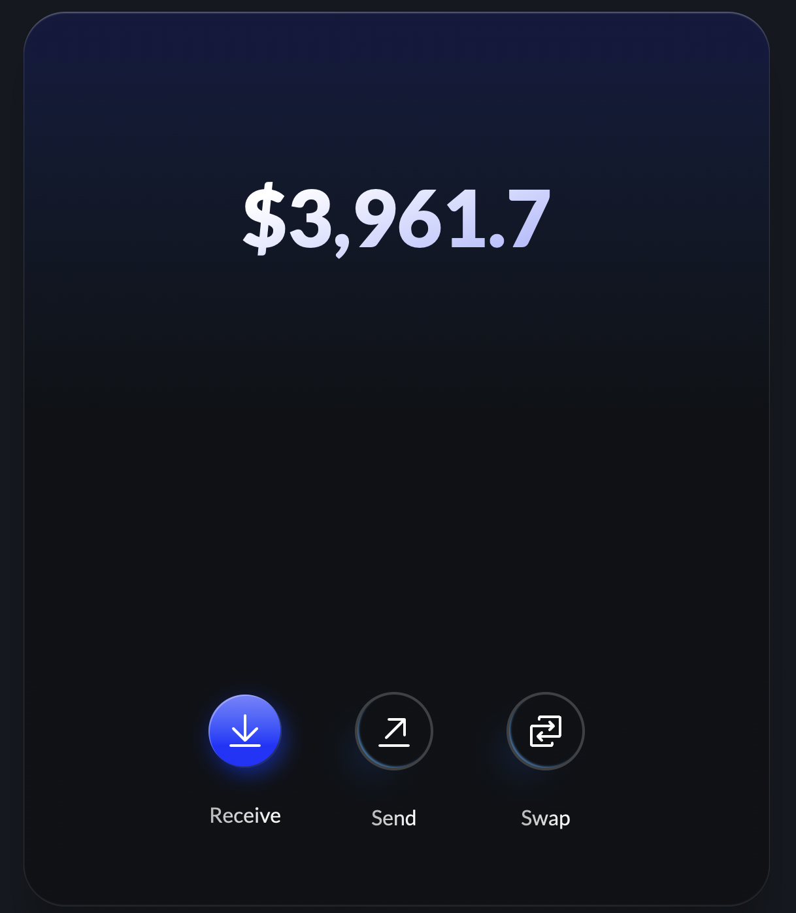
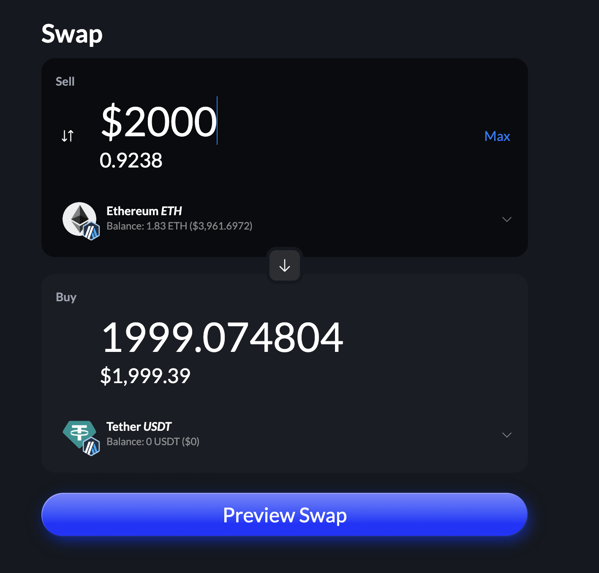
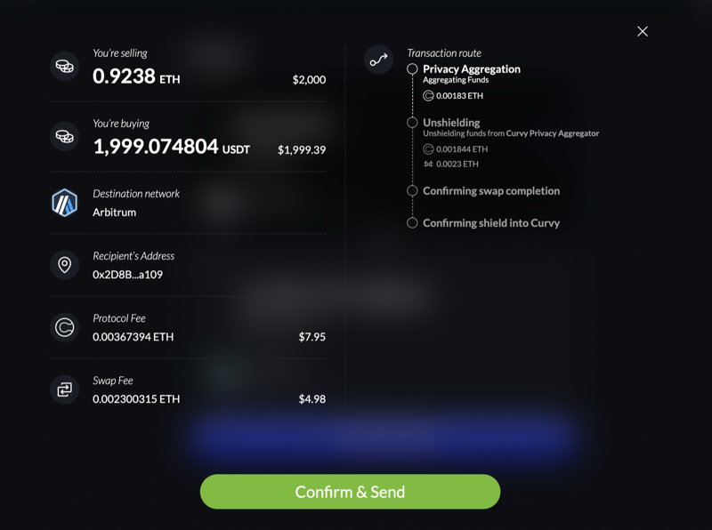
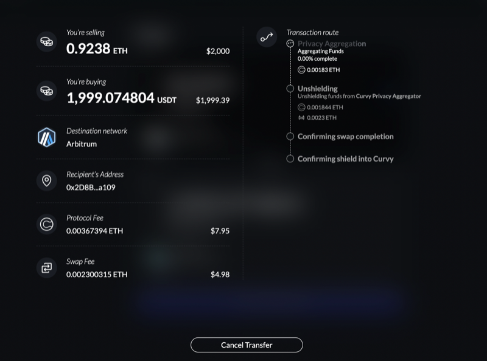

# Swap assets privately

To access the Curvy's builtin swap feature, click on the Swap button in the bottom right corner of your portfolio balance:

The swap UI is made to feel familiar to users of the popular DEXs, simply input the amount you want to swap, choose the currencies and click on the Swap button.

When previewing the swap, you will be presented with a detailed breakdown of the swap, including the associated fees.

After confirming the swap estimation, you can monitor the execution of the swap, as well as the shielding of the resulting swapped assets:

