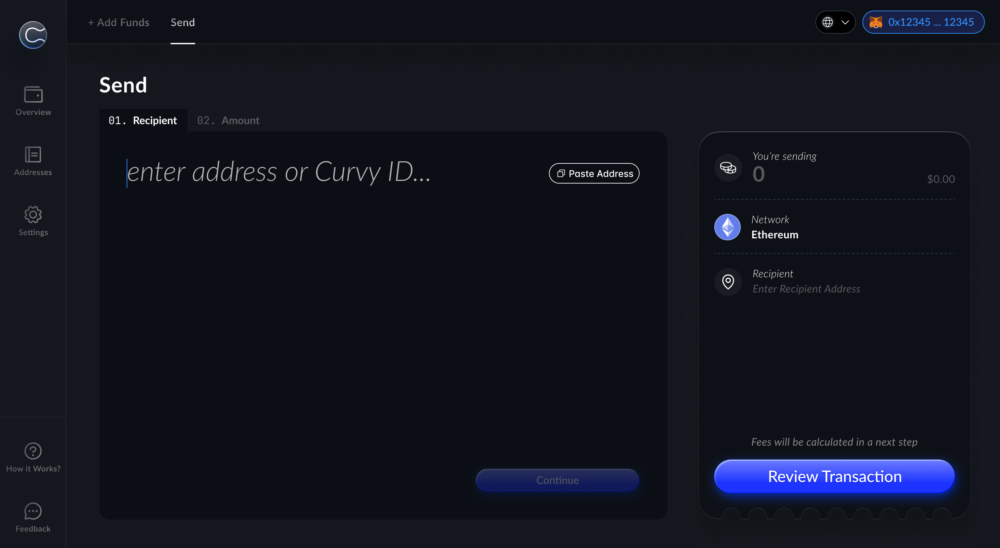
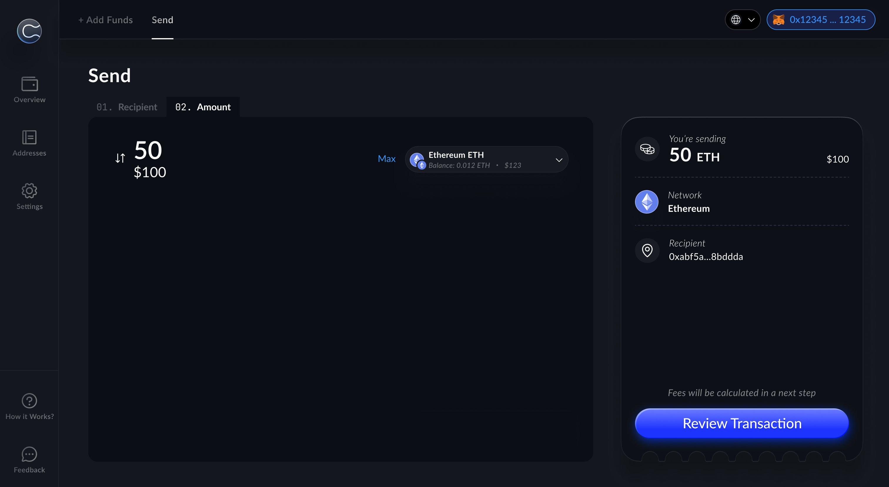
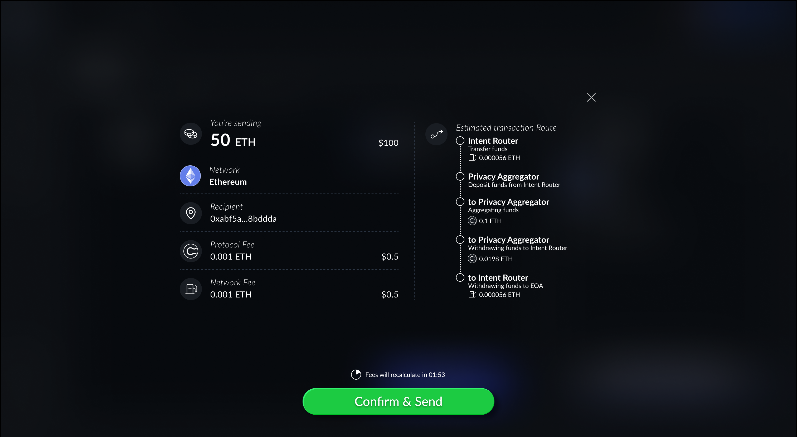
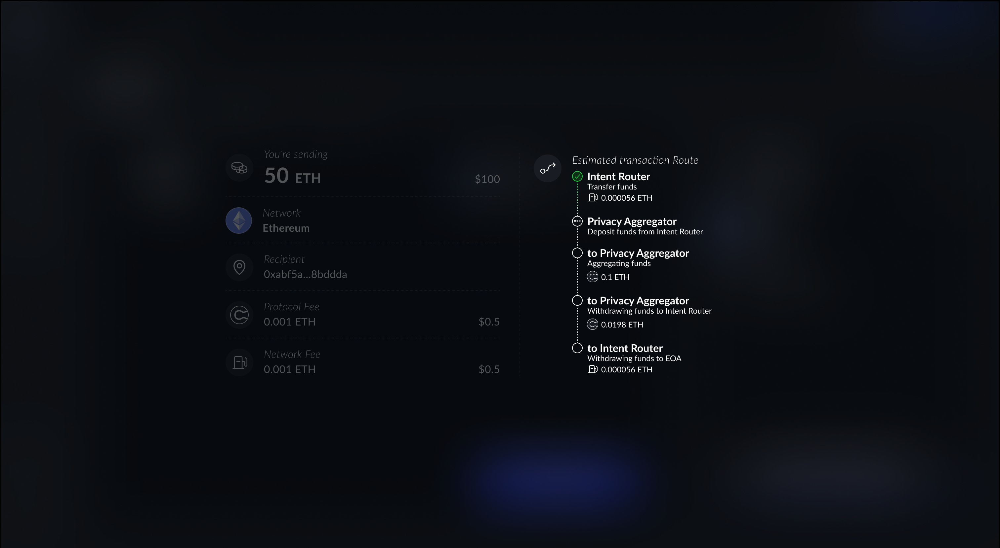
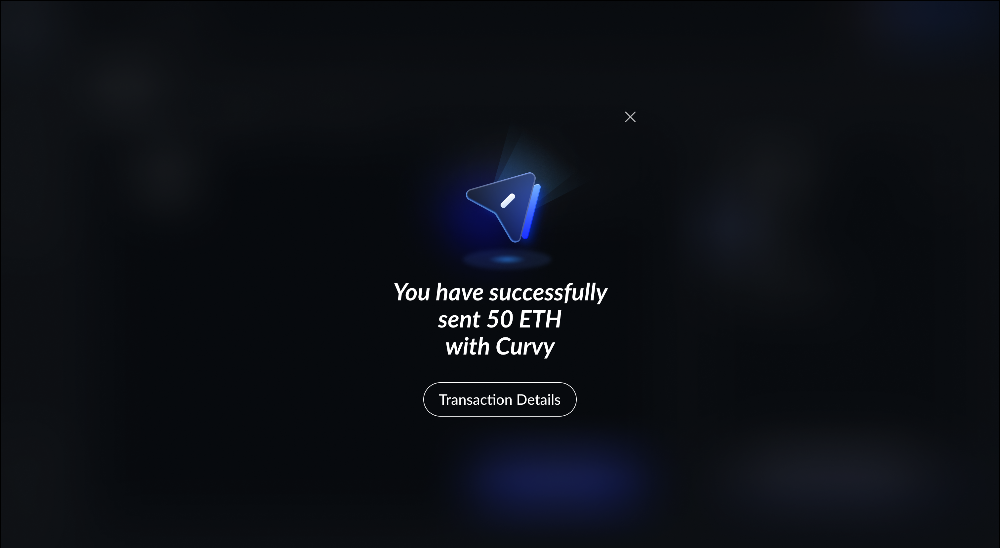
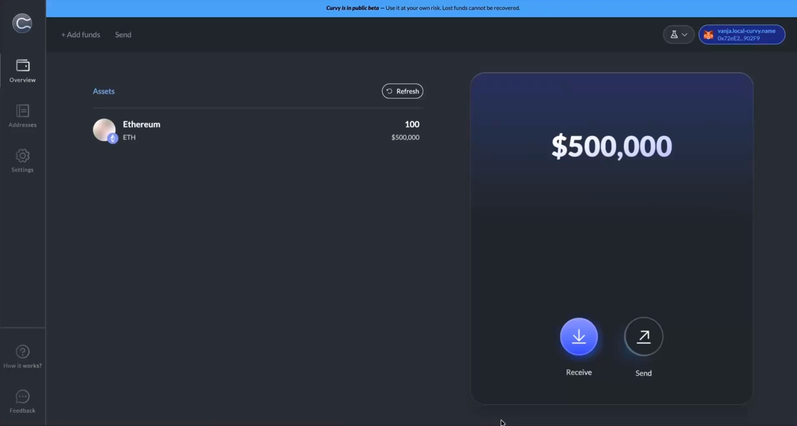

# Sending in V2 (new)

To send funds through the Aggregator.

- Enter the recipient’s Curvy ID or a regular wallet address

- Select token and amount and tap `Review Transaction`

- Tap `Confirm & Send`

- Detailed Insight into the Transaction Route

- Successful Send Confirmation, tap `Transaction Details` to see more

# DEMO: How to use Curvy V2

:::info

Curvy now introduces a more advanced and flexible transaction model based on a bidirectional transaction flow.

When you send funds, you are creating a private 'note' that is submitted to the network via a Relayer. The Relayer batches multiple notes from different users, and our Aggregator verifies them privately on-chain. The recipient can only claim the funds after this process, ensuring the on-chain link between you is completely broken.

This new architecture also covers advanced features like a privacy score, a stealth fee model, and proof validation to provide maximum security and anonymity.

:::
